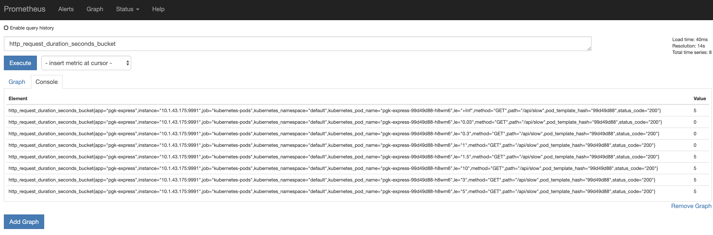

# Prometheus Grafana in Kubernetes

It is the first step to setup [prometheus](https://prometheus.io/) and [grafana](https://grafana.com/) in kubernetes cluster.

To install both prometheus and grafana in the cluster run this command

```console
kubectl apply -k https://github.com/ffoysal/pgk-express/resources
```

It will create following resoruces

```console
namespace/monitoring created
clusterrole.rbac.authorization.k8s.io/prometheus created
clusterrolebinding.rbac.authorization.k8s.io/prometheus created
configmap/prometheus-server-conf-57b29t89dh created
service/grafana created
service/prometheus created
deployment.apps/grafana created
deployment.extensions/prometheus-deployment created
```

Prometheus needs to create clusterrole to scrape metrices from different namespaces and from different resoruces.

To access the prometheus expression browser need to do port forward as both grafana and prometheus services are type ClusterIP

`kubectl port-forward svc/prometheus 8080:8080 -n monitoring`

`kubectl port-forward svc/grafana 3000:3000 -n monitoring`

password for grafana is `admin`

The deployement architecture overview looks like the following diagram


## How Prometheus Works In Short

at the startup of prometheus pod, the configuation file is passed to it. [The file](./resources/prometheus/prometheus.yaml) list all the prometheus jobs that will be run in certain intervals and for example looks for any pod that has thes annotations

```yaml
prometheus.io/port: "9991" #it is metric port
prometheus.io/scrape: "true"
```

Look at this [example](express-app/deploy/deployment.yaml) how it is defined in the deployment yaml file.

In order to see how individual application export metrics so that prometheus can scrape them, there is a sample nodejs app prepared. To install the app run this command

```console
kubectl apply -k github.com/ffoysal/pgk-express/express-app/deploy
```

it will create following resources

```console
service/pgk-express-metrics created
service/pgk-express created
deployment.extensions/pgk-express created
```

do port-forward to access the app

```console
kubectl port-forward svc/pgk-express 4000:4000
```

make few requests to the express app to see the metrics in prometheus 

```console
curl http://localhost:4000/api/slow
curl http://localhost:4000/api/fast
curl http://localhost:4000/api/error
```

then go to the expression browser `http://localhost:8080/` make some query



To see the raw metrics

```console
kubectl port-forward svc/pgk-express-metrics 9991:9991

curl http://localhost:9991/metrics
```

will return something like this

```console
# HELP http_request_duration_seconds duration histogram of http responses labeled with: status_code, method, path
# TYPE http_request_duration_seconds histogram
http_request_duration_seconds_bucket{le="0.03",status_code="200",method="GET",path="/api/slow"} 0
http_request_duration_seconds_bucket{le="0.3",status_code="200",method="GET",path="/api/slow"} 0
http_request_duration_seconds_bucket{le="1",status_code="200",method="GET",path="/api/slow"} 0
http_request_duration_seconds_bucket{le="1.5",status_code="200",method="GET",path="/api/slow"} 5
http_request_duration_seconds_bucket{le="3",status_code="200",method="GET",path="/api/slow"} 5
http_request_duration_seconds_bucket{le="5",status_code="200",method="GET",path="/api/slow"} 5
http_request_duration_seconds_bucket{le="10",status_code="200",method="GET",path="/api/slow"} 5
http_request_duration_seconds_bucket{le="+Inf",status_code="200",method="GET",path="/api/slow"} 5
http_request_duration_seconds_sum{status_code="200",method="GET",path="/api/slow"} 5.0231001
http_request_duration_seconds_count{status_code="200",method="GET",path="/api/slow"} 5

# HELP up 1 = up, 0 = not up
# TYPE up gauge
up 1
```

### Referenc Sites

- https://linuxacademy.com/blog/kubernetes/running-prometheus-on-kubernetes/
- https://kubernetes.github.io/ingress-nginx/user-guide/monitoring/
- https://medium.com/teamzerolabs/node-js-monitoring-with-prometheus-grafana-3056362ccb80
- https://www.npmjs.com/package/api-express-exporter